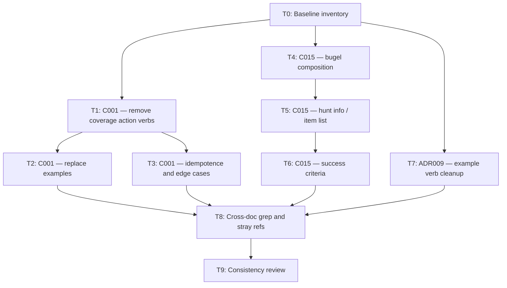

# Implementation plan: simpler coverage model (doc alignment)

> **Working document.** This plan tracks the doc-refactor work for item 1 only (align CLI and Renderer with the engineering README's simpler coverage model). **Delete this file when all tasks are complete.**

## Goal

Remove the legacy candidate / drop-off / per-item accept-reject coverage workflow from engineering docs. The canonical model lives in `docs/engineering/README.md` (Coverage scope rule under C016) and `docs/engineering/adrs/ADR004-selectors-as-first-class-declarations.md`:

- Source-backed items **enter** a hunt's active set when they match the hunt's selectors on refresh.
- They **leave** on the next refresh when they no longer match.
- Scope is adjusted via **selectors** (`selector set`, `hunt selector add/remove`) or **manual items** (`item add`, `item remove`).
- **No** per-item accept/reject, **no** drop-off surface, **no** carry-forward.

## Out of scope

- Item 2 architecture work (slimming C016, membership on Item Store, component rename).
- Go implementation / tests (docs-only pass).
- Product requirement rewrites (O002 R-docs already align; no R003/R004 exist at product layer).
- `resources/previous-sessions/` (historical; leave as-is).

## Canonical references

| Document | What to treat as source of truth |
|---|---|
| `docs/engineering/README.md` | C016 coverage scope rule; C001/C015 relationship summaries |
| `docs/engineering/adrs/ADR004-selectors-as-first-class-declarations.md` | No per-item accept/reject for source-backed items |
| `docs/product/outcomes/J001-O002-coverage/README.md` | RSK003/RSK004 accept silent drop-off from active set |

## Task DAG



**Parallelism:** After T0, T1/T4/T7 can run in parallel. T9 is the merge gate.

---

## Tasks

### T0 — Baseline inventory

**Depends on:** —  
**Blocks:** T1, T4, T7

Capture the full set of stale references before editing.

**Actions:**
1. Run ripgrep for: `item accept`, `item reject`, `carry-forward`, `drop-off`, `Item candidates`, `coverage candidate`, `already in active set`, `already rejected`.
2. Record hits under `docs/engineering/` only (ignore `resources/previous-sessions/`).
3. Paste the file list into this plan under **Inventory** (below) and check off when done.

**Acceptance criteria:**
- [x] Inventory section populated with every engineering doc hit and line context.
- [x] No edits made in this task (plan inventory/progress only).

---

### T1 — C001: remove coverage action verbs

**Depends on:** T0  
**Blocks:** T2, T3  
**File:** `docs/engineering/components/C001-cli.md`

**Actions:**
1. Remove from the `item` verb block:
   - `bdog item accept`
   - `bdog item reject`
   - `bdog item carry-forward`
2. Remove the paragraph describing "Coverage actions operate on items in candidate or drop-off state…" (keep `confirm-owner` behavior text intact).
3. Keep **Source-backed item scope** paragraph unchanged — it already matches the canonical model.

**Acceptance criteria:**
- [x] No `accept`, `reject`, or `carry-forward` subcommands remain under `item`.
- [x] Manual capture (`item add` / `item remove` / `item set --hunt`) and source-backed scope rule still documented.

---

### T2 — C001: replace walkthrough examples

**Depends on:** T1  
**Blocks:** T8  
**File:** `docs/engineering/components/C001-cli.md`

**Actions:**
1. Delete sections **Accepting a coverage candidate** and **Carrying a drop-off forward** (and their shell examples).
2. Add one short example showing scope change via selectors, e.g. broaden a selector → `hunt bugel --dry-run` → `hunt bugel` (can extend the existing "Adding a selector to a live hunt" example rather than adding a new section).
3. Optionally add a one-liner example: item falls out of active set when selector no longer matches (no bird-dogger action required).

**Acceptance criteria:**
- [x] No walkthrough references `item accept`, `reject`, or `carry-forward`.
- [x] At least one example demonstrates selector-driven scope change as the primary coverage adjustment path.

---

### T3 — C001: idempotence table and side-effecting verbs list

**Depends on:** T1  
**Blocks:** T8  
**Files:** `docs/engineering/components/C001-cli.md`

**Actions:**
1. Remove the `item accept/reject/carry-forward` row from the **Idempotence** table.
2. Update **Side-effecting actions on own verbs** (if listed) to drop coverage action verbs; retain `confirm-owner`, `rotate-token`, `hunt activate/deactivate`, `touch record-response`.
3. Scan **Edge cases** and **Design decisions** for any remaining candidate/drop-off language; remove or rewrite.

**Acceptance criteria:**
- [x] Idempotence table has no coverage-action rows.
- [x] Side-effecting verb lists use only verbs that still exist in the doc.

---

### T4 — C015: bugel composition

**Depends on:** T0  
**Blocks:** T5  
**File:** `docs/engineering/components/C015-renderer.md`

**Actions:**
1. Remove bugel sections **5. Drop-offs** and **6. Item candidates** entirely.
2. Renumber remaining sections (Notes recap → 5; decide on Source candidates — see **Decision: source candidates** below).
3. Update the opening composition list for `bdog hunt bugel` to match the slimmer shape.

**Target bugel composition:**

```
header → source availability (when needed) → active items table → notes recap [→ source candidates if retained]
```

**Decision: source candidates (section 7 today)**

Product O002 RSK002 states candidate sources are **not** surfaced automatically. The engineering README does not describe a source-candidate bugel section. **Default for this plan: remove section 7 (Source candidates)** for consistency with the simpler model. If you want to keep it as a deferred/out-of-scope note instead, add a single sentence under Design decisions rather than a bugel section.

**Acceptance criteria:**
- [ ] No drop-off or item-candidate sections in bugel spec.
- [ ] Section numbering and ordered list are internally consistent.
- [ ] Source-candidate disposition explicitly recorded (removed or deferred note).

---

### T5 — C015: hunt info, item list, and related surfaces

**Depends on:** T4  
**Blocks:** T6  
**File:** `docs/engineering/components/C015-renderer.md`

**Actions:**
1. Update `bdog hunt info` count summary to: **active items** and **source availability** only (drop drop-off / candidate item counts; drop candidate source count if T4 removed source candidates).
2. Update `bdog item list` description: remove "drop-off/candidate" phrasing; clarify it shows the active set for `--hunt` (same columns as bugel table, no header sections).
3. Scan `item info` and other surfaces for hunt-membership language that implies candidate/drop-off states; fix if found.

**Acceptance criteria:**
- [ ] `hunt info` and `hunt list` descriptions match the simpler model.
- [ ] `item list` does not reference removed bugel sections.

---

### T6 — C015: success criteria

**Depends on:** T5  
**Blocks:** T8  
**File:** `docs/engineering/components/C015-renderer.md`

**Actions:**
1. Replace success-criteria bullets that mention drop-offs, item candidates, or candidate counts.
2. New composition bullet should match T4 target (four or five sections, per source-candidate decision).

**Acceptance criteria:**
- [ ] **Success criteria** section contains zero references to drop-offs or item candidates.
- [ ] Bugel composition bullet matches the **Renderer surfaces** section body.

---

### T7 — ADR009: replace removed verbs in examples

**Depends on:** T0  
**Blocks:** T8  
**File:** `docs/engineering/adrs/ADR009-side-effecting-actions-on-dedicated-verbs.md`

**Actions:**
1. Remove `item accept`, `item reject`, `item carry-forward` from Context, Options, Decision, and Consequences example lists.
2. Retain `item confirm-owner`, `hunt activate/deactivate`, `source rotate-token`, `touch record-response` as the illustrative action verbs.
3. Replace error-vocabulary examples that referenced accept/reject (`already in active set`, `already rejected`) with examples from remaining verbs (e.g. `confirm-owner` not idempotent; `hunt activate` idempotent no-op).

**Acceptance criteria:**
- [ ] ADR009 argument unchanged (dedicated verbs vs flags on `set`).
- [ ] No references to removed coverage action verbs anywhere in the ADR.

---

### T8 — Cross-doc grep and stray references

**Depends on:** T2, T3, T6, T7  
**Blocks:** T9

**Actions:**
1. Re-run the T0 ripgrep patterns across `docs/engineering/`.
2. Fix any remaining hits in engineering docs (expected clean files: C001, C015, ADR009; possible hits in README component blurbs — verify only, README should already be canonical).
3. Do **not** edit product docs unless an engineering doc cross-link explicitly contradicts them (none expected).

**Acceptance criteria:**
- [ ] Zero matches for `item accept`, `item reject`, `item carry-forward` under `docs/engineering/`.
- [ ] Zero matches for `drop-off` / `Item candidates` in C001 and C015 (ADR/product "drop-off" in risk acceptance prose is fine elsewhere).

---

### T9 — Consistency review (merge gate)

**Depends on:** T8  
**Blocks:** — (plan complete → delete this file)

**Actions:**
1. Read C001 `item` + `hunt` sections and C015 bugel spec side-by-side; confirm they tell the same coverage story as README C016 scope rule.
2. Confirm ADR004, README, C001 source-backed scope paragraph, and C015 active-items table are aligned on: selector match = in, no gate, silent leave on refresh.
3. Check off all task acceptance criteria below.
4. Delete `plans/refactor-for-slimmer.md`.

**Acceptance criteria:**
- [ ] All task checkboxes in this plan marked complete.
- [ ] No internal contradictions between C001, C015, ADR009, and engineering README.
- [ ] Plan file removed from repo.

---

## Inventory

<!-- T0 complete 2026-06-24. Patterns: item accept, item reject, carry-forward, drop-off, Item candidates, coverage candidate, already in active set, already rejected. Scope: docs/engineering/ only. -->

| File | Line(s) | Pattern | Snippet / note |
|---|---|---|---|
| `docs/engineering/components/C001-cli.md` | 226 | item accept | `bdog item accept <item> --hunt <hunt>` — verb block (stale) |
| `docs/engineering/components/C001-cli.md` | 227 | item reject | `bdog item reject <item> --hunt <hunt>` — verb block (stale) |
| `docs/engineering/components/C001-cli.md` | 228 | carry-forward | `bdog item carry-forward <item> --hunt <hunt>` — verb block (stale) |
| `docs/engineering/components/C001-cli.md` | 231 | drop-off, carry-forward | Coverage actions paragraph: candidate/drop-off state, accept/reject/carry-forward (stale) |
| `docs/engineering/components/C001-cli.md` | 235 | item accept/reject | Source-backed scope rule — canonical negative ("no per-item accept/reject") |
| `docs/engineering/components/C001-cli.md` | 340 | item accept/reject/carry-forward | Idempotence table row (stale) |
| `docs/engineering/components/C001-cli.md` | 546 | coverage candidate | Section heading "Accepting a coverage candidate" (stale) |
| `docs/engineering/components/C001-cli.md` | 551 | item accept | Walkthrough example (stale) |
| `docs/engineering/components/C001-cli.md` | 554 | item reject | Walkthrough example (stale) |
| `docs/engineering/components/C001-cli.md` | 557–563 | drop-off, carry-forward | Section "Carrying a drop-off forward" + example (stale) |
| `docs/engineering/components/C015-renderer.md` | 39 | drop-off | Bugel §5 Drop-offs section (stale) |
| `docs/engineering/components/C015-renderer.md` | 41 | Item candidates, item accept/reject | Bugel §6 Item candidates section (stale) |
| `docs/engineering/components/C015-renderer.md` | 61 | drop-off | `item list` — "drop-off/candidate sections" phrasing (stale) |
| `docs/engineering/components/C015-renderer.md` | 65 | drop-off | `hunt info` count summary includes drop-offs, candidate items (stale) |
| `docs/engineering/components/C015-renderer.md` | 86 | drop-off, Item candidates | Success criteria bugel composition bullet (stale) |
| `docs/engineering/components/C015-renderer.md` | 87 | drop-off | Success criteria hunt info counts (stale) |
| `docs/engineering/adrs/ADR009-side-effecting-actions-on-dedicated-verbs.md` | 17–18 | item accept/reject/carry-forward | Context verb list (stale examples) |
| `docs/engineering/adrs/ADR009-side-effecting-actions-on-dedicated-verbs.md` | 21 | already in active set | accept idempotence example (stale) |
| `docs/engineering/adrs/ADR009-side-effecting-actions-on-dedicated-verbs.md` | 51 | item accept/reject | Options example list (stale) |
| `docs/engineering/adrs/ADR009-side-effecting-actions-on-dedicated-verbs.md` | 55 | already in active set | Error vocabulary example (stale) |
| `docs/engineering/adrs/ADR009-side-effecting-actions-on-dedicated-verbs.md` | 65 | already in active set | Consequences argument (stale) |
| `docs/engineering/adrs/ADR009-side-effecting-actions-on-dedicated-verbs.md` | 88 | item accept | Decision prose (stale) |
| `docs/engineering/adrs/ADR009-side-effecting-actions-on-dedicated-verbs.md` | 99, 101 | already in active set, item accept | Contrast with `item set --accept` (stale) |
| `docs/engineering/adrs/ADR009-side-effecting-actions-on-dedicated-verbs.md` | 122–123 | already in active set, already rejected | Error reporting per verb (stale) |
| `docs/engineering/adrs/ADR004-selectors-as-first-class-declarations.md` | 33 | item accept/reject | Canonical negative — "no per-item accept or reject for source-backed items" |
| `docs/engineering/README.md` | 218 | item accept/reject, drop-off | Coverage scope rule — canonical (negates accept/reject, no drop-off surface) |
| `docs/engineering/README.md` | 170, 267 | carry-forward | Triage State Carry-Forward (J001-O004-R004) — unrelated to coverage; no edit |
| `docs/engineering/adrs/ADR003-read-only-against-sources.md` | 11 | carry-forward | Triage State Carry-Forward (J001-O004-R004) — unrelated to coverage; no edit |

**Summary:** 25 hits across 6 files. Stale (T1–T8 targets): C001 (10), C015 (6), ADR009 (10). Canonical/keep-as-is: ADR004 (1), README coverage rule (1). Unrelated triage carry-forward: README (2), ADR003 (1).

---

## Progress

| Task | Status |
|---|---|
| T0 | complete |
| T1 | complete |
| T2 | complete |
| T3 | done |
| T4 | complete |
| T5 | complete |
| T6 | pending |
| T7 | complete |
| T8 | pending |
| T9 | pending |

---

## Notes

- **PRD001 "never silently disappeared"** was incorrectly cited on the drop-offs section (C015 §5). Under RSK003, items leaving the active set is an accepted outcome; visibility is via the active set itself, not a drop-off audit trail.
- **O003-R005 "candidate alongside override"** uses "candidate" in the override-disagreement sense, not coverage candidates — no product doc changes needed.
- After this plan completes, item 2 (C016 slimming / membership location) deserves its own plan file.
