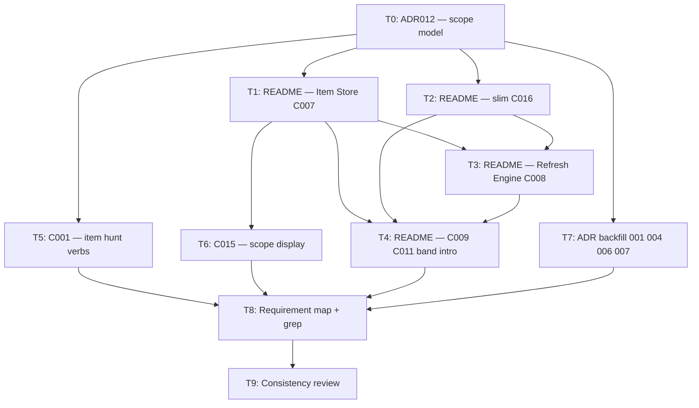

# Implementation plan: scope via selectors (architecture docs)

> **Working document.** Records the agreed scope model (dual junctions in Item Store, selector-deduped refresh, manual multi-hunt via `item_hunts`) and tracks engineering-doc updates. **Delete this file when all tasks are complete.**

## Prerequisite

Complete `plans/refactor-for-slimmer.md` first (simpler coverage model in C001/C015 — no accept/reject/drop-offs). This plan assumes that doc alignment is done.

## Goal

Replace `(hunt, item)` membership in Coverage Memory with **materialized scope in Item Store**, and slim C016 to hunt-level refresh metadata only.

### Locked decisions

| # | Decision | Choice |
|---|---|---|
| D1 | Materialized scope storage | **Dual junctions in Item Store (C007):** `item_selectors(item_id, selector_id)` for source-backed scope; `item_hunts(item_id, hunt_id)` for manual multi-hunt assignment |
| D2 | Refresh unit of work | **Selector-deduped:** collect unique selectors across target hunts; pull each once per bugel; reconcile `item_selectors`; update per-hunt metadata in C016 |
| D3 | Manual multi-hunt | **`item hunt` sub-commands** (`add` / `remove` / `list`); optional repeated `--hunt` on `item add` for convenience; no single `owning_hunt` scalar |
| D4 | Active set query | Union: items linked to any of hunt H's selectors **∪** items in `item_hunts` for H |
| D5 | Selector edit mid-quarter | Declaration changes immediately; `item_selectors` reconciles on next full refresh; `--no-refresh` uses last materialized links |
| D6 | C016 role | **Hunt refresh metadata only:** set-level `last_refresh`, per-hunt `(hunt, source)` availability snapshot — no membership rows |

### Canonical active-set definition (for reviewers)

```
active_set(H) =
  { item | ∃ selector S : (item, S) ∈ item_selectors ∧ S ∈ hunt(H).selectors }
  ∪
  { item | (item, H) ∈ item_hunts }
```

## Out of scope

- Go implementation, SQLite migrations, and tests (no application code in repo yet; optional follow-on phase after docs land).
- Product requirement rewrites (O002 R-docs already align with silent leave / selector-driven scope).
- Renumbering component ids (C016 keeps its id; display name may change — see T2).
- `resources/previous-sessions/` (historical).

## Deliverables

| Artifact | Purpose |
|---|---|
| `docs/engineering/adrs/ADR012-scope-via-selectors.md` | Records D1–D6, schema shapes, refresh algorithm, edge cases |
| `docs/engineering/README.md` | C007, C008, C009, C011, C016 sections + State band intro |
| `docs/engineering/components/C001-cli.md` | `item hunt` verbs; manual capture without sole `owning_hunt` |
| `docs/engineering/components/C015-renderer.md` | Active-set / `item info` hunt membership display |
| `docs/engineering/adrs/ADR001`, `ADR004`, `ADR006`, `ADR007` | Consequence updates for new model |

Optional (only if README sections grow too large): `docs/engineering/components/C007-item-store.md`, `C008-refresh-engine.md`, `C016-hunt-refresh-state.md`.

## Task DAG



**Parallelism:** After T0, T1/T2/T5/T7 can run in parallel. T3 waits on T1+T2. T9 is the merge gate.

---

## Tasks

### T0 — ADR012: scope materialization model

**Depends on:** prerequisite doc plan complete  
**Blocks:** T1, T2, T5, T7  
**File:** `docs/engineering/adrs/ADR012-scope-via-selectors.md` (new)

Author the decision record. Suggested sections:

1. **Context** — why `(hunt, item)` in C016 duplicates selector semantics; item→selector→hunt join path.
2. **Options** — dual junctions vs unified `item_scope` vs materialized `(hunt, item)` in C016 (rejected).
3. **Decision** — D1–D6 from this plan.
4. **Schema** (documentation-level, not migration SQL):
   - `item_selectors(item_id, selector_id)` — PK or unique on pair; optional `matched_at` for debugging.
   - `item_hunts(item_id, hunt_id)` — PK or unique on pair; manual items only (enforce by origin tag in component contract).
   - C016: `hunt_refresh(hunt_id, refreshed_at)`; `hunt_source_availability(hunt_id, source_id, status, reason, refreshed_at)`.
5. **Refresh algorithm** — selector-deduped steps: resolve hunts → unique selectors → pull → upsert items → reconcile `item_selectors` per selector (add new links, remove stale links for that selector) → write C016 per affected hunt.
6. **Edge cases** — selector edit before refresh; item matches two selectors in one hunt (dedupe in query); shared selector across hunts; item out of scope but retained in Item Store; `--no-refresh` / `--dry-run` behavior pointers.
7. **Consequences** — C009/C011 scope reads move to Item Store query; C016 no longer read for membership.

**Acceptance criteria:**
- [x] ADR012 exists and matches locked decisions D1–D6.
- [x] Active-set union formula appears verbatim.
- [x] Selector-deduped refresh algorithm is stepwise and unambiguous.

---

### T1 — README: Item Store (C007)

**Depends on:** T0  
**Blocks:** T3, T4, T6  
**File:** `docs/engineering/README.md` (C007 section)

**Actions:**
1. Add scope junction ownership to C007 responsibilities: `item_selectors`, `item_hunts`.
2. Clarify: source-backed scope is **refresh-materialized** selector links; manual scope is **CLI-materialized** hunt links.
3. Update relationships: Refresh Engine writes `item_selectors`; CLI writes `item_hunts` via `item hunt` verbs; C016 no longer holds membership.
4. Revise per-item / per-hunt seam sentence: Item Store holds item facts **and materialized scope edges**; C016 holds hunt refresh aggregates only.
5. Note: items may exist with zero selector/hunt links (history retained per ADR007 / RSK003).

**Acceptance criteria:**
- [x] C007 lists both junction tables and their writers.
- [x] No claim that C016 stores `(hunt, item)` membership.

---

### T2 — README: slim C016 (Hunt Refresh State)

**Depends on:** T0  
**Blocks:** T3, T4  
**File:** `docs/engineering/README.md` (C016 section, State band intro line 9)

**Actions:**
1. Replace C016 responsibilities: remove active set membership and `(hunt, item)` keys.
2. Retain: set-level last-refresh marker, per-hunt source-availability snapshot keyed `(hunt, source)`.
3. Move **Coverage scope rule** to C007 or ADR012 cross-link (rule stays canonical; C016 no longer owns “what is included”).
4. Optional rename in prose: “Hunt Refresh State” while keeping component id **C016** (note rename in ADR012 consequences if adopted).
5. Update State band bullet (line ~9): per-hunt refresh metadata in C016; materialized scope edges in C007.

**Acceptance criteria:**
- [x] C016 section describes only refresh timestamp + availability snapshot.
- [x] Coverage scope rule still reachable from README (C007 or link to ADR012).
- [x] Component id C016 unchanged unless a separate rename ADR is explicitly added (default: id stays).

---

### T3 — README: Refresh Engine (C008)

**Depends on:** T1, T2  
**Blocks:** T4  
**File:** `docs/engineering/README.md` (C008 section)

**Actions:**
1. Replace “walk each referenced selector **per hunt**” with **selector-deduped** orchestration (see ADR012).
2. Write sites: `item_selectors` reconciliation on C007; hunt refresh metadata on C016 (not membership).
3. Document: one selector pull updates scope for **all hunts** referencing that selector.
4. `--no-refresh`: skip all C008 writes including `item_selectors` reconciliation.
5. `--dry-run`: preview membership delta without writing (pointer to C001 behavior).

**Acceptance criteria:**
- [x] C008 does not write `(hunt, item)` rows anywhere.
- [x] Selector-deduped refresh is the documented default path.

---

### T4 — README: Assessment & Synthesis scope reads (C009, C011)

**Depends on:** T1, T2, T3  
**Blocks:** T8  
**File:** `docs/engineering/README.md` (C009, C011 sections; Reasoning band intro if needed)

**Actions:**
1. C009: active set scoped via **Item Store query** (active_set(H) union), not C016 membership read.
2. C011: same; C016 read limited to hunt refresh metadata if needed for freshness display (not for item enumeration).
3. Update relationship bullets that say “Coverage Memory (C016): reads active set”.

**Acceptance criteria:**
- [x] C009 and C011 reference Item Store for item enumeration per hunt.
- [x] C016 read role is refresh metadata only (or absent from enumeration path).

---

### T5 — C001: `item hunt` sub-commands and manual capture

**Depends on:** T0  
**Blocks:** T8  
**File:** `docs/engineering/components/C001-cli.md`

**Actions:**
1. Add **`item hunt`** sub-resource (mirror `hunt selector` pattern):
   ```
   bdog item hunt add    <item> <hunt>...
   bdog item hunt remove <item> <hunt>...
   bdog item hunt list   <item>
   ```
2. **`item add`:** remove required single `--hunt` **or** change to optional repeatable `--hunt` that seeds initial `item_hunts` rows (pick one in ADR012; document chosen shape). Item creation must not imply a sole owning hunt.
3. Remove / replace **`item set --hunt`** single-hunt reassignment with pointer to `item hunt add/remove` (or deprecate `set --hunt` with migration note in ADR007 task).
4. Update idempotence table for `item hunt add/remove`.
5. Add walkthrough: manual item in two hunts; selector edit affecting only source-backed peers.
6. Update **Removal semantics** / hunt `remove` pre-step: clear `(item, hunt)` rows for manual items (not “reassign `--hunt`” singular).

**Acceptance criteria:**
- [x] Multi-hunt manual membership is documented and operable via CLI.
- [x] No “owning hunt” singular model remains as the primary path.
- [x] Examples consistent with ADR012.

---

### T6 — C015: scope display surfaces

**Depends on:** T1  
**Blocks:** T8  
**File:** `docs/engineering/components/C015-renderer.md`

**Actions:**
1. **`item info` Identity section:** replace “owning hunt (for manual items)” with **Hunts** — list all hunts the item is in scope for (derived: selector overlap ∪ manual `item_hunts`), with origin hint per hunt (selector-matched vs manually assigned).
2. **`item list --hunt` / bugel active table:** clarify rows are `active_set(H)` per ADR012 formula.
3. **`hunt info`:** active-item count defined as `|active_set(H)|`; no membership storage implication in C016.
4. Optional: note when selector declaration changed since `last_refresh` (deferred UX — one sentence under Design decisions if not specifying markers yet).

**Acceptance criteria:**
- [x] Renderer docs do not imply C016 enumerates items.
- [x] Multi-hunt manual items display correctly in Identity.

---

### T7 — ADR backfill: 001, 004, 006, 007

**Depends on:** T0  
**Blocks:** T8  
**Files:**
- `docs/engineering/adrs/ADR001-source-hunt-decoupling.md`
- `docs/engineering/adrs/ADR004-selectors-as-first-class-declarations.md`
- `docs/engineering/adrs/ADR006-native-id-scheme.md`
- `docs/engineering/adrs/ADR007-no-cascade-removal.md`

**Actions:**
1. **ADR001:** replace “two membership facts under Coverage Memory (C016)” with item_selectors × hunts referencing shared selectors; link ADR012.
2. **ADR004:** add consequence: refresh materializes `item_selectors`; selector edit propagates on next pull.
3. **ADR006:** if needed, note junction tables key on `bdogitem-<n>` and config entity ids for selector/hunt foreign keys.
4. **ADR007:** hunt `remove` pre-step for manual items → remove all `item_hunts` rows for that hunt (or block until none); source-derived scope clears via selector/hunt membership, not manual unlink.

**Acceptance criteria:**
- [x] No ADR still claims `(hunt, item)` membership lives in C016.
- [x] ADR007 manual-item teardown matches multi-hunt model.

---

### T8 — Requirement map, cross-links, and grep

**Depends on:** T4, T5, T6, T7  
**Blocks:** T9

**Actions:**
1. Review **Requirement–Component Map** in README: J001-O002-R001, R002, R006, J001-O001-R006 — adjust component lists if C007 now owns scope edges (R001/R002 may add explicit C007 scope role; R006 still C016 + C008).
2. Grep `docs/engineering/` for stale phrases:
   - `(hunt, item)`
   - `active set membership per hunt` in C016 context
   - `owning hunt`
   - `Coverage Memory.*active set`
   - `two membership rows in Coverage Memory`
3. Fix hits or add forward pointers to ADR012.

**Acceptance criteria:**
- [ ] Requirement map matches new responsibilities.
- [ ] Grep inventory clean or explicitly documented exceptions.

---

### T9 — Consistency review (merge gate)

**Depends on:** T8  
**Blocks:** — (plan complete → delete this file)

**Actions:**
1. Walk through a scenario end-to-end in docs: shared selector across two hunts → selector `set` → `--no-refresh` bugel → full bugel; manual item in two hunts via `item hunt add`.
2. Verify C001, C015, README C007/C008/C016/C009/C011, and ADR012 tell one story.
3. Check all task checkboxes below.
4. Delete `plans/scope-via-selectors.md`.

**Acceptance criteria:**
- [ ] All task checkboxes marked complete.
- [ ] No internal contradictions across engineering docs.
- [ ] Plan file removed from repo.

---

## Grep inventory

<!-- T8: paste ripgrep results here -->

| Pattern | File | Status |
|---|---|---|
| *(pending T8)* | | |

---

## Progress

| Task | Status |
|---|---|
| T0 | complete |
| T1 | complete |
| T2 | complete |
| T3 | complete |
| T4 | complete |
| T5 | complete |
| T6 | complete |
| T7 | complete |
| T8 | pending |
| T9 | pending |

---

## Notes

- **Component naming:** “Coverage Memory” undersells slim C016; prose may say “Hunt Refresh State (C016)” without renumbering.
- **Future implementation phase** (separate plan when Go code exists): SQLite DDL, Refresh Engine reconciliation, active_set query helper, CLI handlers for `item hunt`, integration tests for selector edit + multi-hunt manual paths.
- **C007 component doc:** create only if the README section exceeds ~40 lines after T1; otherwise keep single source in README + ADR012.
